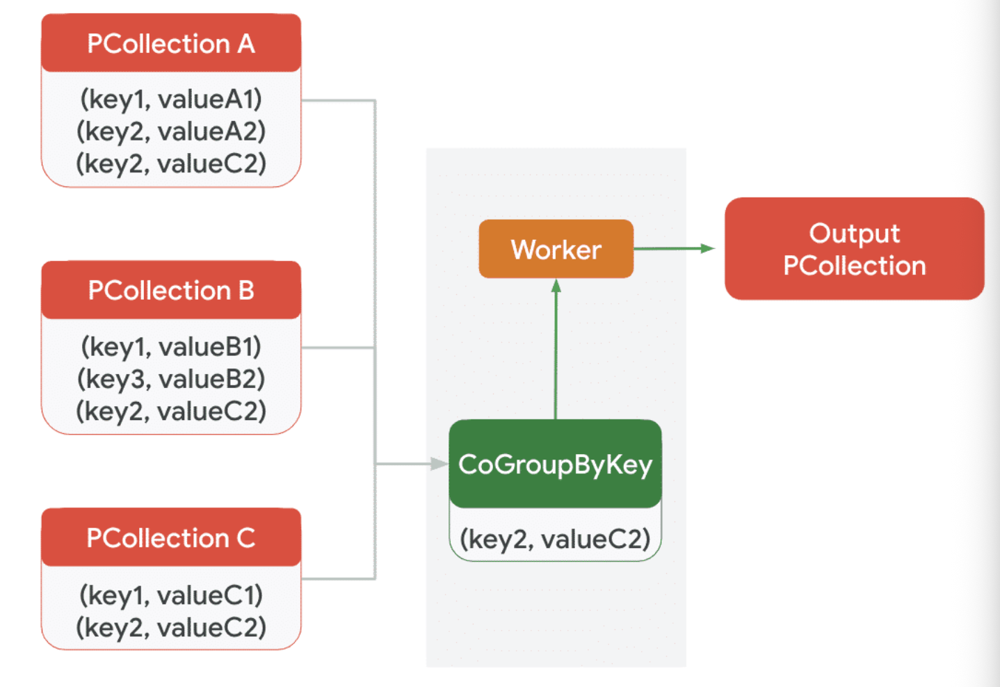
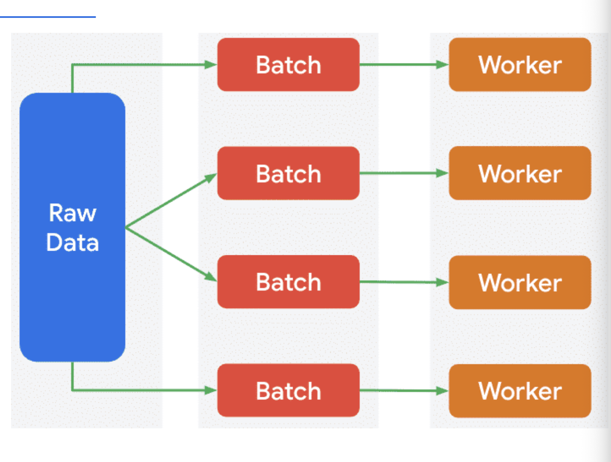
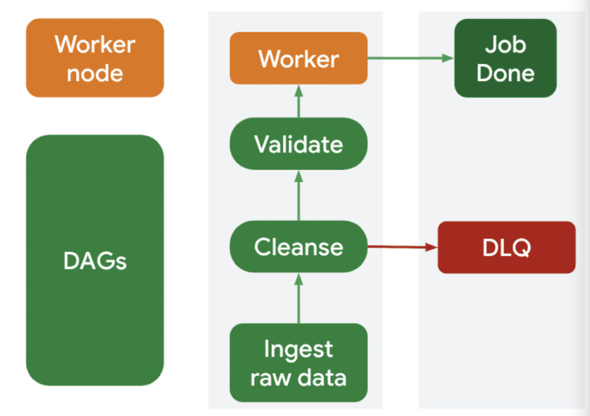

# Module 2: Design and build batch data pipelines

## Large scale data transformations

### Google Cloud data processing engines

- **Dataflow**: unified programming model (Apache Beam) for batch and streaming, defines pipelines as transformation DAGs.
- **Dataflow when**: scalable cloud-native pipelines, ideal for complex ETL, new robust data solutions and real-time streaming.
- **Serverless for Apache Spark**: managed environment for Apache Spark.
- **Spark when**: migrating existing Spark/Hadoop workloads, strong for data science/ML workflows relying on Spark libraries, or existing team expertise around Spark.

### Principles

- **Immutability**: once data records are created they should not be changed.
- **Idempotency**: repeated execution of a transformation yields the same result.
- **Schema enforcement**: data must conform with a predefined structure.

## Dataflow

- PCollections and Transforms are used to implement the above principles.
- **ParDo**: general purpose parallel processing transform that applies a user-defined function (UDF) to each element in a PCollection, producing zero or many elements.
- ParDo is ideal for data cleansing (filtering, parsing complex fields and type conversion) or enrichment (adding calculated fields).
- **GroupByKey**: groups elements in a key-value PCollection by their key, essential for preparing data for aggregation by bringing related records together on a single worker or set of workers.
- **Combine**: aggregates values in a PCollection, used after GroupByKey (as Combine.PerKey) to compute sums, averages, counts or custom aggregations for a group, or globally (as Combine.Globally) across an entire PCollection.
- **CoGroupByKey**: performs a multi-input join, grouping elements from two or more key-value PCollections by their common keys.
- CoGroupByKey is used in scenarios that require more complex data integration, where you need to combine related data from disparate sources.
- Implement Dataflow transformations via the Job Builder UI and templates (encapsulate underlying Beam Transforms).
- You can define input/output paths, specify filtering rules or map data fields directly in the UI.
- You can also write custom Beam pipeline code and deploy it as a custom Dataflow template.



### Apache Beam

- Batch or streaming pipelines with the language of your choice.
- PCollection (Parallel Collections) is an immutable unordered collection of values.
- PCollection is a distributed dataset.
- PTransform is an operation in a pipeline performed to one or more PCollections.
- PTransforms take PCollections as input and output PCollections allowing for them to be chained.
- Pipeline is a Directed Acyclic Graph of data transformations, the entire workflow.
- Windows group elements by timestamp (fixed, sliding, session).

### Dataflow design principles

- **Distributed processing**: tasks are distributed across multiple worker nodes.
- **Optimal batch sizing**: determine the right volume of data to process in a single Dataflow job to balance latency and efficiency.
- **Data partitioning**: consider how data is partitioned to minimize shuffling across the network.
- **I/O optimization**: choose efficient file formats (Avro, Parquet) when dealing with Cloud Storage to reduce read/write times and reduce storage cost.
- **Native connectors**: utilise native connectors (TextIO, BigQueryIO).
- **Resource tuning**: design to allow for appropriate worker machine types and autoscaling settings, enough compute resources without over-provisioning.
- **Schema enforcement and evolution**: plan for defining and enforcing data schemas, consider how you will handle changes to input schemas over time without breaking the pipeline.
- **Error handling and dead letter queues**: implement robust mechanisms to catch and route erroneous records to a DLQ (backup queue for data that cannot be processed correctly) so that the pipeline can continue to process valid data.
- Break down transformations into smaller, more manageable steps, increasing reusability and maintainability.



**DLQ**



## Transforms with Serverless for Apache Spark

- Define transformations with PySpark (DataFrame API) or Spark SQL.
- Data cleansing includes `filter`, `dropDuplicates`, `withColumn` (add or modify a column), and `na.fill` (handle missing values).
- Data enrichment is done via join operations between DataFrames and aggregations using `groupBy`.
- Custom code in languages like Python can be written, or Dataproc templates can be used.
- Instead of writing transformation logic directly for each job, you design parameterized Spark applications that are submitted as templates.
- In these templates you specify input/output, transformation rules, and aggregation keys.
- Templates promote reusability and operational efficiency.
- Handles infrastructure so you can focus on code; automatically scales compute resources depending on job needs.

```python
df1.join(df2, on="key", how="inner")
```

## Apache Spark concepts

- **DataFrames**: Structured as rows and columns.
- **Dataset**: DataFrame structure with type safety.
- **Transforms**: create a new abstraction from an existing one, lazy transformations only executed when an action is called.
- **Action**: trigger execution of the transformations and return the result.
- **Driver program**: runs the main() function and creates the SparkContext, coordinates distributed operations on the cluster.
- **Executors**: worker processes that run tasks and store data.
- **Tasks**: individual units of work performed by executors on partitions of data.
- **Stages**: physical execution plan broken into sets of tasks that can run in parallel, a shuffle operation typically marks the boundary between stages.
- To ensure scalability, Serverless for Apache Spark utilises distributed processing by automatically managing and provisioning Spark clusters.
- You should also partition your data in Cloud Storage or BigQuery.

### Reusability

- Dataproc templates can be shared between colleagues.
- Parameterize applications rather than hardcoding values.
- Make Spark applications modular, break down into smaller self-contained units rather than one massive script.

## Data connections and orchestration

- **Cloud SQL**: use for batch pipelines where the data needs to be served to applications that require a traditional database (MySQL, PostgreSQL, or SQL Server).
- Cloud SQL can get overwhelmed from a large number of parallel workers (Dataflow) or executors (Spark), it is not designed for massive parallel write throughput like BigQuery.
- Cloud SQL is more expensive per gigabyte than dedicated analytics database or object storage.
- **BigQuery**: use for batch pipelines that output large datasets.
- BigQuery is optimized for bulk inserts, is massively scalable, and cost-effective (pay-per-query).
- **Cloud Storage**: Destination for raw or intermediate output of a data pipeline, highly scalable and durable.
- Cloud storage has flexible formats like parquet or avro, acts as landing zone for data before loading it into analytical data warehouse BigQuery.

### Cloud SQL when

- Data set is small to moderate (optimized for OLTP workloads/transactions).
- Low latency access is required for applications like web backend or CRM.
- Data requires relational integrity.
- Team skilled in standard SQL.

### BigQuery when

- Output data is large.
- Goal is analytics not transactions.
- You need a serverless no-ops data warehouse.

### Cloud Storage when

- You need a cheap durable landing zone.
- Output data is semi-structured or unstructured.
- You are building a data lake architecture.

### Best practices

- Use optimized columnar formats for bulk data transfers.
- Use purpose built native connectors where possible.
- Batching and Buffering: group multiple records into a single write operation.
- Ensure schema consistency, match to the destination.
- Error handling: DLQs (Dead Letter Queues) route failed records for inspection, allow the main pipeline to continue processing valid data without interruption.
- Monitor I/O performance and address bottlenecks.

## Cloud Composer

- Manages execution, retries, and worker node progress.
- Managed workflow orchestration service built on Apache Airflow.
- Schedule scripts as DAGs.
- **Directed**: each task has a direction or flow, data moves from one task to the next.
- **Acyclic**: workflow never loops back on itself, no cycles.

### Step 1: verify workflow with a manual run

```bash
# Apache Spark
gcloud dataproc batches submit pyspark your-script.py --region=<your-region>
```

```bash
# Dataflow
gcloud dataflow jobs run my-job-from-template --gcs-location=<gcs-template-path> --parameters=<key>=<value>
```

### Step 2: Automate with Cloud Composer

```bash
gcloud dataproc batches submit pyspark your-script.py \
   --region=us-central1 \
   --version=2.2 \
   --jars=gs://.../iceberg-spark-runtime.jar,gs://.../iceberg-bq-catalog.jar
```

### DAG

```python
# The DAG sets the hourly schedule
with DAG(dag_id="auto_batch", schedule_interval="@hourly", ... ) as dag:
    
    # This operator defines the job to be run
    submit_spark_batch = DataprocCreateBatchOperator(
        task_id="orders_aggregator_hourly",
        region="us-central1", # Corresponds to --region flag
        batch={
            "pyspark_batch": {
                # Corresponds to the python script file
                "main_python_file_uri": "gs://...", 
            },
            "runtime_config": {
                "version": "2.2", # Corresponds to --version flag
            },
        },
    )
```

## Execute an Apache Spark pipeline

### Scenario

- **Data Source**: raw data stored in Iceberg tables.
- **Data Transformation**: PySpark reads the raw data from Iceberg and applies transformations (cleaning, filtering and aggregations).
- **Data Sink**: after processing data is read by other spark jobs and BigQuery.
- **Orchestration**: Cloud Composer orchestrates the entire workflow (scheduling, triggering, monitoring and handles retries).
- **Destination**: processed data is then saved back to Apache Iceberg on Cloud Storage.

### Setup steps

- Enable APIs for Dataproc, Cloud Composer and BigQuery.
- Create a Cloud Composer environment.
- Ensure composer service account has (storage object viewer, BQ data editor and user, dataproc editor and worker) permissions.
- Create a cloud storage bucket and a BigQuery dataset.
- Set up a VPC network.

### PySpark script

- Batch job to analyze data and find the 20 most popular items in each city based on sales from the last hour.

#### Step 1: Initial Configuration

- Tell Spark where to find tools and data.
- Define cloud storage paths.
- Setup BigQuery's metastore catalog properties (so Spark can understand the structure and location of Iceberg tables).
- Specify full names of input tables and output tables.

```python
# --- Configuration ---
# Define your GCS paths for the Iceberg and BigQuery jars
ICEBERG_SPARK_RUNTIME_JAR = "gs://<your-path>/iceberg/jars/iceberg-spark-runtime-3.5_2.12-1.6.1.jar"
ICEBERG_BIGQUERY_CATALOG_JAR = "gs://spark-lib/bigquery/iceberg-bigquery-catalog-1.6.1-1.0.1-beta.jar"

# Define your catalog properties
CATALOG_NAME = "bqms"
CATALOG_IMPL = "org.apache.iceberg.spark.SparkCatalog"
CATALOG_BIGQUERY_IMPL = "org.apache.iceberg.gcp.bigquery.BigQueryMetastoreCatalog"
WAREHOUSE_PATH = "gs://<your-bucket-name>/warehouse"
GCP_PROJECT = "<your-project-name>"
GCP_LOCATION = "<your-region>"

# Input and output table names
INPUT_ORDERS_TABLE = f"{CATALOG_NAME}.ecommerce.orders"
INPUT_ORDER_ITEMS_TABLE = f"{CATALOG_NAME}.ecommerce.order_items"
OUTPUT_TABLE = f"{CATALOG_NAME}.ecommerce.top_20_items_per_city_recent"
```

#### Step 2: Data Ingestion

- Set up a SparkSession.
- Creates temporary SQL views making data available for SQL queries without loading it all into memory at once.

```python
# --- SparkSession Initialization ---
spark = (
    SparkSession.builder.appName("Top20ItemsPerCityLastHourSQL")
    .config("spark.jars", f"{ICEBERG_SPARK_RUNTIME_JAR},{ICEBERG_BIGQUERY_CATALOG_JAR}")
    .config(f"spark.sql.catalog.{CATALOG_NAME}", CATALOG_IMPL)
    # ... other configurations
    .getOrCreate()
)

# --- Register Base Tables as Temporary Views for Spark SQL ---
spark.sql(f"""
      CREATE TEMPORARY VIEW orders_view AS
      SELECT ... FROM {INPUT_ORDERS_TABLE}
""")

spark.sql(f"""
      CREATE TEMPORARY VIEW order_items_view AS
      SELECT ... FROM {INPUT_ORDER_ITEMS_TABLE}
""")
```

#### Step 3: Data Transformation

- Join and filter (orders to order items for orders in the last hour).
- Aggregate (calculate the total quantity sold for each item in each city).
- Rank (window function is used to assign a rank to each item in each city).
- Final selection (limit to the top 20 items for each city, rank less than or equal to 20).

```python
# Step 1: Join orders_view and order_items_view and filter for recent orders
spark.sql(f"""
      CREATE TEMPORARY VIEW joined_recent_orders_items_view AS ...
""")

# Step 2: Aggregate item sales per city
spark.sql(f"""
      CREATE TEMPORARY VIEW item_sales_per_city_view AS ...
""")

# Step 3: Rank items within each city
spark.sql(f"""
      CREATE TEMPORARY VIEW ranked_items_view AS ...
""")

# Step 4: Filter for top 20 ranked items and get final DataFrame
top_items_per_city_df = spark.sql(f"""
      SELECT ... WHERE rank <= 20
""")
```

#### Step 4: Land to a Data Sink

- Write top_items_per_city_df to new Iceberg table.
- Use the .createOrReplace() command to ensure each hourly run provides a fresh complete data set, overwriting the previous one.

```python
# --- Write Results to a New Iceberg Table ---
top_items_per_city_df.writeTo(OUTPUT_TABLE) \
  .using("iceberg") \
  .createOrReplace()

# Stop the SparkSession (essential for standalone scripts)
spark.stop()
```

### gcloud CLI commands

- Set environment variables for the JAR files.
- JAR files allow Spark to interact with Iceberg and BigQuery tables.

```bash
# Set environment variables for the JAR file paths
export ICEBERG_SPARK_RUNTIME_JAR=gs://<your-bucket>/jars/iceberg-spark-runtime-3.5_2.12-1.6.1.jar
export ICEBERG_BIGQUERY_CATALOG_JAR=gs://spark-lib/bigquery/iceberg-bigquery-catalog-1.6.1-1.0.1-beta.jar
```

- Submit the batch job

```bash
# Tells google cloud you want to run a Pyspark script as a serverless batch job
gcloud dataproc batches submit pyspark top_items_aggregator_job.py \
    --project=<your-gcp-project-id> \
    --region=<your-region> \
    --version=2.2 \
    --network=<your-vpc-network> \
    --deps-bucket=gs://<your-staging-bucket> \
    --jars=$ICEBERG_SPARK_RUNTIME_JAR,$ICEBERG_BIGQUERY_CATALOG_JAR
```

## Optimize batch pipeline performance

- **Job profiling**: Use specialized tools to graphically represent job execution, identify stages where processing time is disproportionately high.
- **Data skew detection**: Identify instances where data is unevenly distributed across workers, leading to some being overloaded whilst others are idle.
- The job monitoring interface in Dataflow offers an execution graph that highlights hot spots and inefficiencies.
- **Spark History Server (SSUI)**: provides detailed execution graphs and metrics while Cloud Logging and Cloud Monitoring enable custom dashboards and alerts.

### Resolving bottlenecks

- **Bottleneck**: any factor that limits the overall throughput or speed of a batch pipeline.
- **Resource tuning bottleneck**: in Dataflow you can configure worker machine types and autoscaling limits via UI/template params. Adjust Spark properties (executor memory/cores, number of executors) in the template.
- **Code optimization**: optimize custom UDFs/transforms in Dataflow templates and Beam logic. Optimize code for Spark DataFrames, SQL.
- **Data skew**: preprocess data to mitigate skew for advanced templates, use Beam's re-partitioning (Dataflow). Implement Spark strategies in code: key salting, custom partitioning, pre-aggregation.
- **I/O optimization**: configure sources/sinks, focus on file size, compression and data partitioning in storage.

### Dataflow UI for optimization

- Analyze batch pipeline performance.
- Tools include the job graph (DAG), job logs, job metrics (CPU utilization and throughput) and Dataflow Insights.
- **Dataflow Insights**: automates a proactive approach by leveraging AI to analyze performance metrics and execution details of job runs.
- Dataflow Insights has hot key detection which alerts you if your data is not evenly distributed (common cause of slowness in GroupByKey/join operations).
- Dataflow Insights provides you with suggested changes to pipeline options or code to improve throughput or reduce cost.

### Spark UI and Gemini insights for optimization

- Use the Dataproc UI to check logs and high-level metrics.
- Use the Spark UI to analyze jobs, stages and executors.
- Use Metrics Explorer to analyze specific performance counters, and Gemini for AI-powered recommendations and actionable insights.
- A Spark job is a high-level action in code (like writing data to a file); a tab in the SSUI shows the list of all jobs as well as their status and duration.
- Each Spark job is broken into stages (a set of tasks executed in parallel without shuffling data); look at each stage to identify which transformations are taking the most time.
- Executors are the worker processes that run your tasks; a tab shows how many were used, their memory and disk usage, and the number of tasks completed.
- The environment tab details all the Spark configuration properties that were active during the job run (verify your job ran with the correct settings for memory and parallelism).
- SQL/DataFrame tab (if you used Spark SQL): this tab shows the query plans.

### Cloud Monitoring

- Allows you to create your own charts to correlate different metrics.
- Create custom dashboards for any of the hundreds of available Spark metrics.


